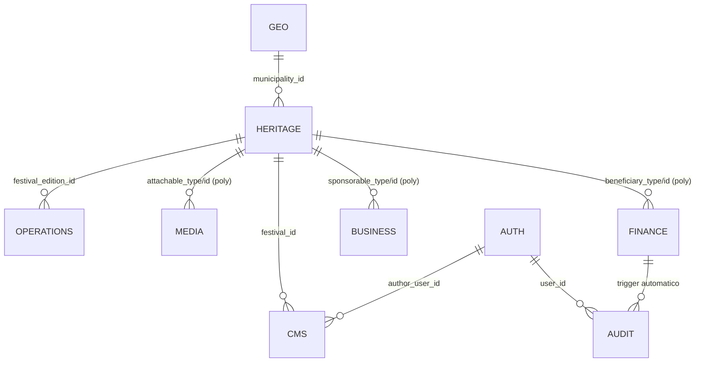
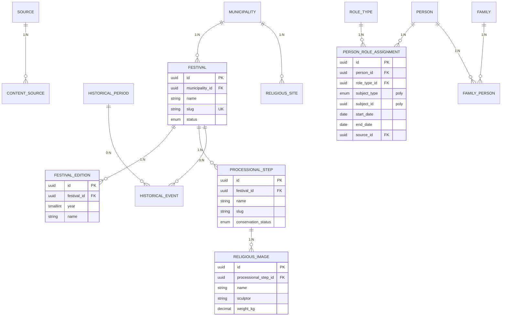
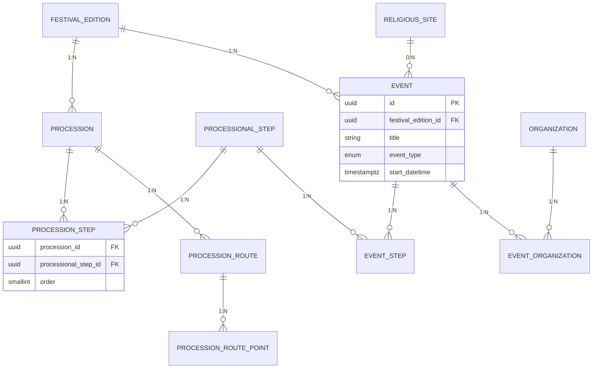
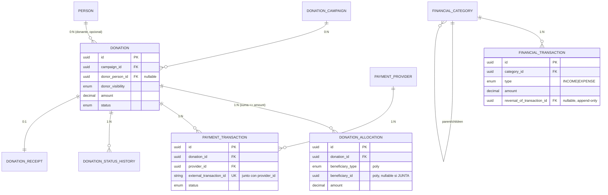
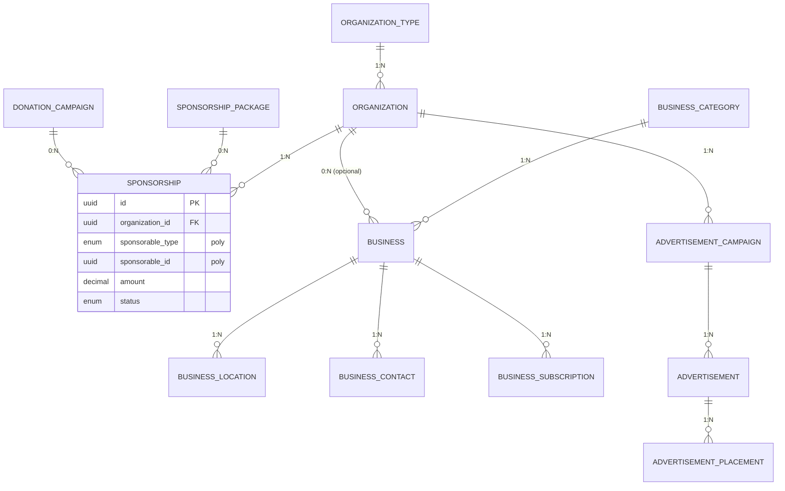
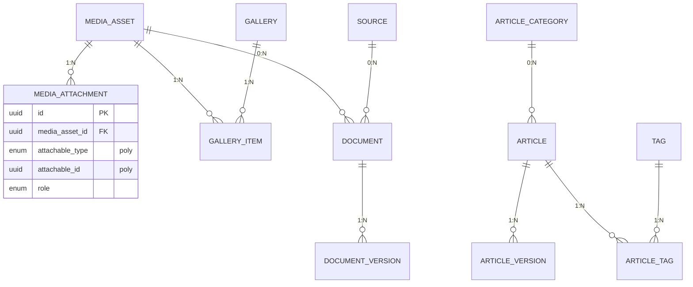
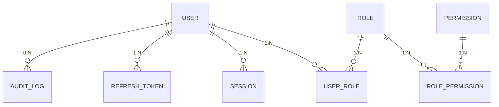

# Diagrama entidad-relación

70 tablas en 9 schemas hacen inviable un solo diagrama legible. Se muestra
primero el mapa de dominios y luego un ERD detallado por dominio con las
tablas y cardinalidades más relevantes. Las relaciones polimórficas
(`*_type`/`*_id`, ver `ARCHITECTURE.md §J.1`) se marcan como líneas
punteadas conceptuales en el texto, no como FK en los diagramas Mermaid
(Mermaid no expresa "FK condicional").

## Mapa de dominios

## Heritage core (festividad, patrimonio)

## Operations (procesiones, eventos)

## Finance (donaciones — el núcleo crítico)

## Business (patrocinadores, directorio, publicidad)

## Media / CMS

## Auth / Audit

Ver `ARCHITECTURE.md` para el razonamiento detrás de cada decisión y
`prisma/schema/*.prisma` para los campos completos de cada tabla.
